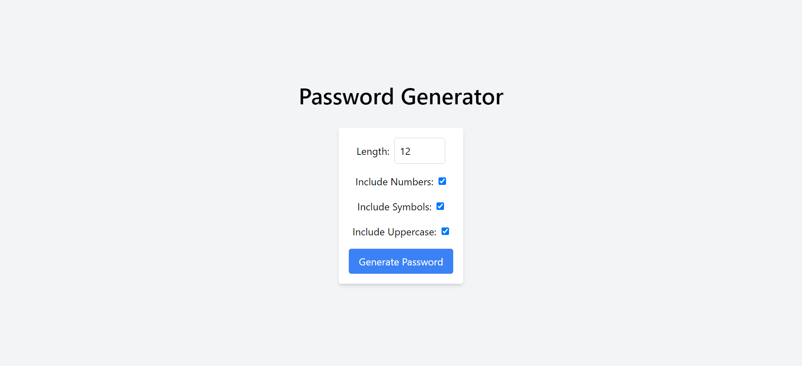

Sure! Below is a sample README file for your Password Generator app, including instructions and a placeholder for a screenshot.

---

# Password Generator

This is a simple Password Generator application built with React. The application allows users to generate random passwords with customizable options such as length, inclusion of numbers, symbols, and uppercase letters.

## Features

- Customize the length of the password
- Option to include numbers
- Option to include symbols
- Option to include uppercase letters
- Generate a random password based on selected options

## Screenshot



## Getting Started

To get a local copy up and running follow these simple example steps.

### Prerequisites

- Node.js installed on your local machine

### Installation

1. Clone the repo

   ```sh
   git clone https://github.com/your-username/password-generator.git
   ```

2. Install NPM packages

   ```sh
   npm install
   ```

### Usage

1. Run the app

   ```sh
   npm start
   ```

2. Open [http://localhost:3000](http://localhost:3000) to view it in the browser.

### Built With

- [React](https://reactjs.org/) - A JavaScript library for building user interfaces
- [Tailwind CSS](https://tailwindcss.com/) - A utility-first CSS framework for rapid UI development

## License

Distributed under the MIT License. See `LICENSE` for more information.

## Contact

Project Link: [https://github.com/omk1r/password-generator](https://github.com/your-username/password-generator)

---
